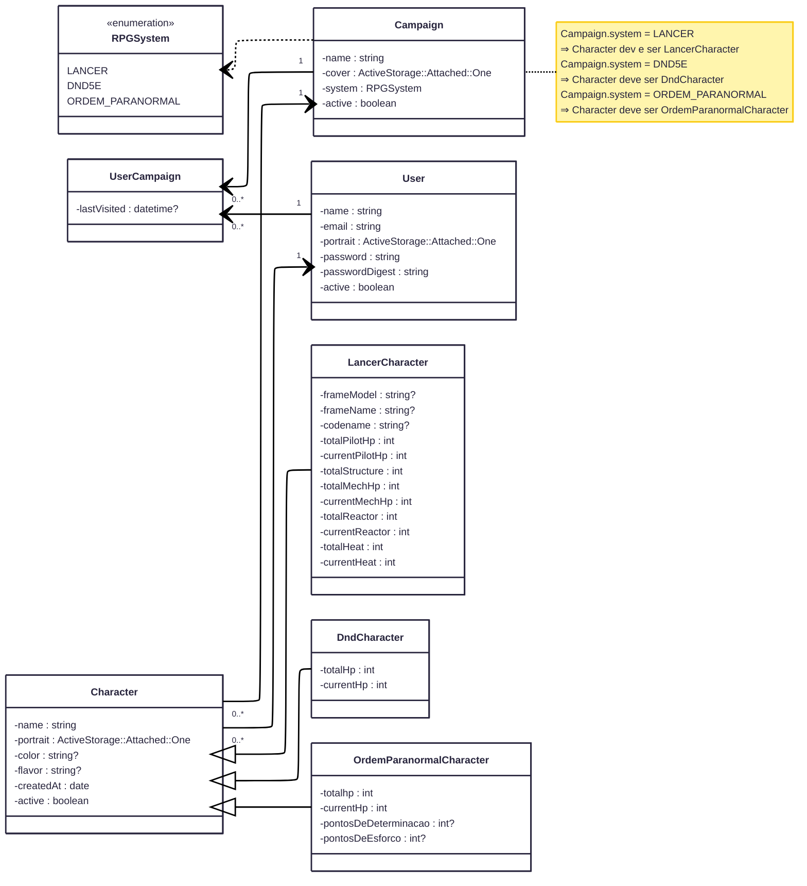

```mermaid
---
config:
  theme: redux
  layout: elk
---
classDiagram
direction RL
    class RPGSystem {
        <<enumeration>>
        LANCER
        DND5E
        ORDEM_PARANORMAL
    }

    class Campaign {
	    -name : string
        -cover : ActiveStorage::Attached::One
	    -system : RPGSystem
        -active : boolean
    }

    note for Campaign "
Campaign.system = LANCER
⇒ Character dev  e ser LancerCharacter

Campaign.system = DND5E
⇒ Character deve ser DndCharacter

Campaign.system = ORDEM_PARANORMAL
⇒ Character deve ser OrdemParanormalCharacter
    "

    class User {
        -name : string
	    -email : string
        -portrait : ActiveStorage::Attached::One
	    -password : string
        -passwordDigest : string
        -active : boolean
    }

    class UserCampaign {
        -lastVisited : datetime?
    }

    class Character {
	    -name : string
        -portrait : ActiveStorage::Attached::One
	    -color : string?
	    -flavor : string?
	    -createdAt : date
        -active : boolean
    }

    class LancerCharacter {
	    -frameModel : string?
	    -frameName : string?
	    -codename : string?
	    -totalPilotHp : int
	    -currentPilotHp : int
	    -totalStructure : int
	    -totalMechHp : int
	    -currentMechHp : int
	    -totalReactor : int
	    -currentReactor : int
	    -totalHeat : int
	    -currentHeat : int
    }

    class DndCharacter {
	    -totalHp : int
	    -currentHp : int
    }

    class OrdemParanormalCharacter {
	    -totalhp : int
	    -currentHp : int
	    -pontosDeDeterminacao : int?
	    -pontosDeEsforco : int?
    }

    Campaign ..> RPGSystem
    User "1" --> "0..*" UserCampaign
    Campaign "1" --> "0..*" UserCampaign
    User "1" <-- "0..*" Character
    Campaign "1" <-- "0..*" Character
    LancerCharacter --|> Character
    OrdemParanormalCharacter --|> Character
    DndCharacter --|> Character
```